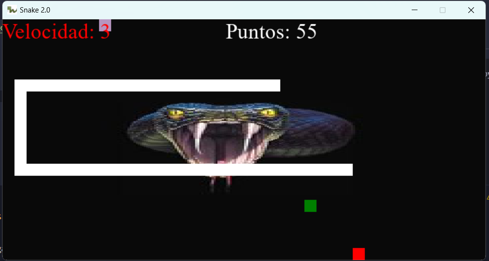
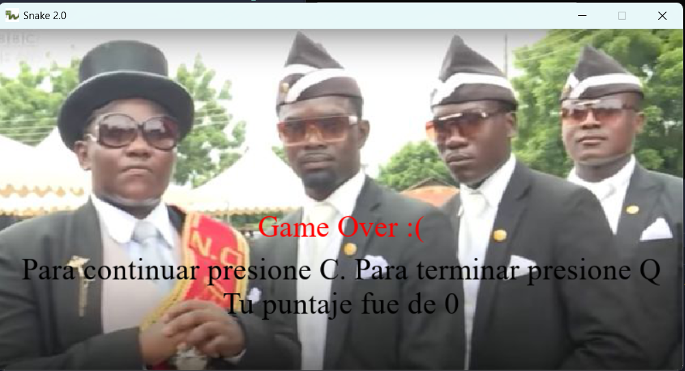

# Utilización de expresiones regulares en python

Proyecto creado experimentar con la librería pygame


|| |
|-------------------|--------------------|

## Instalar
```bash
git clone https://github.com/cozakoo/JuegoSerpiente2.0_python.git

python -m venv <venv>

source <venv>/Scripts/activate
  
cd JuegoSerpiente2.0_python/
  
pip install -r requirements.txt

python snake.py
```
### Activar venv
  
| Platform | Shell           | Command to activate virtual environment |
| -------- | --------------- | --------------------------------------- |
| POSIX    | bash/zsh        | $ source <venv>/bin/activate            |
|          | fish            | $ source <venv>/bin/activate.fish       |
|          | csh/tcsh        | $ source <venv>/bin/activate.csh        |
|          | PowerShell Core | $ <venv>/bin/Activate.ps1               |
| Windows  | cmd.exe         | C:\> <venv>\Scripts\activate.bat        |
|          | PowerShell      | PS C:\> <venv>\Scripts\Activate.ps1     |

### Configurar variables de entorno
